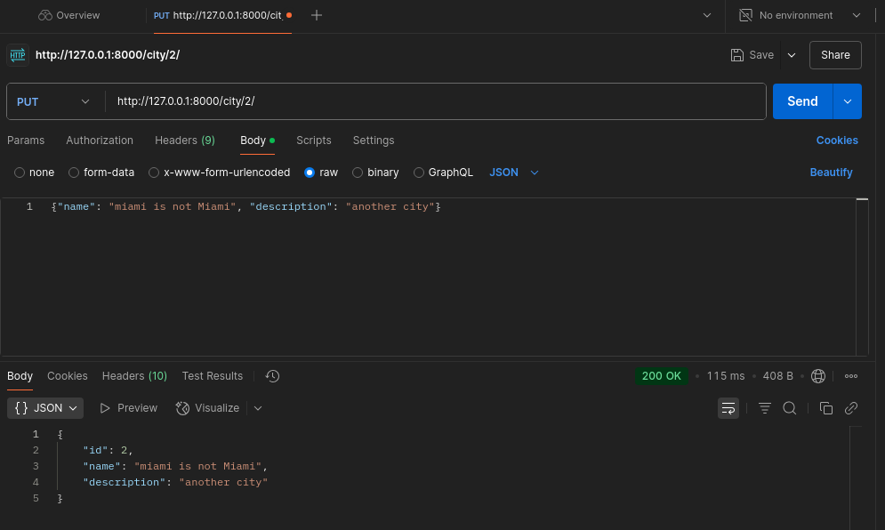

# Weather Services

## Installation and launch

1. Clone repositories:

   With HTTP
   ```bash
   git clone https://github.com/k0drin/City-temperature.git
   ```

   With SSH
   ```bash
   git clone git@github.com:k0drin/City-temperature.git
   ```

2. Install the virtual environment and activate it:
   ```bash
    python3 -m venv venv
    source venv/bin/activate  # For Windows, use `venv\Scripts\activate`
    ```
3. Install all dependencies:
   ```bash
    pip install -r requirements.txt
    ```
4. Now you can make migrations:
   ```bash
    python manage.py makemigrations
    ```
5. Then simply apply the migrations:
   ```bash
    python manage.py migrate
    ```

5. For start run:
    ```bash
    python manage.py runserver
    ```

6. After launching, you can see something like this:

    

7. Also you can check unit test:
    ```bash
   python manage.py test city.tests.test_views    
   ```

8. To check the main functionality
* GET http://127.0.0.1:8000/city/ - return all cities

    

* GET http://127.0.0.1:8000/city/{city_id} - return info about specific city by {city_id}

    

* POST http://127.0.0.1:8000/city/ - create new city

    
    

* PUT http://127.0.0.1:8000/city{city_id} - update city info

    
    

* DELETE http://127.0.0.1:8000/city{city_id} - delete city

    
    

* POST http://127.0.0.1:8000/city/{city_id}/ setTemperature/ - create city temperature

    
    

* GET http://127.0.0.1:8000/stats/ - return average temperature from all cities
    

* GET http://localhost:8000/stats/?city_city_id={city_city_id} - return average temperature from specific city
    
